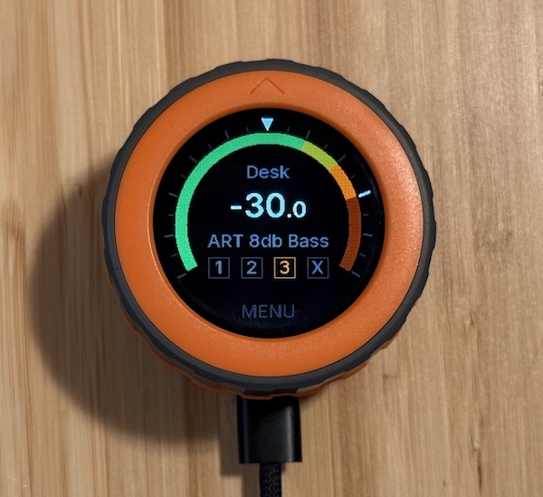
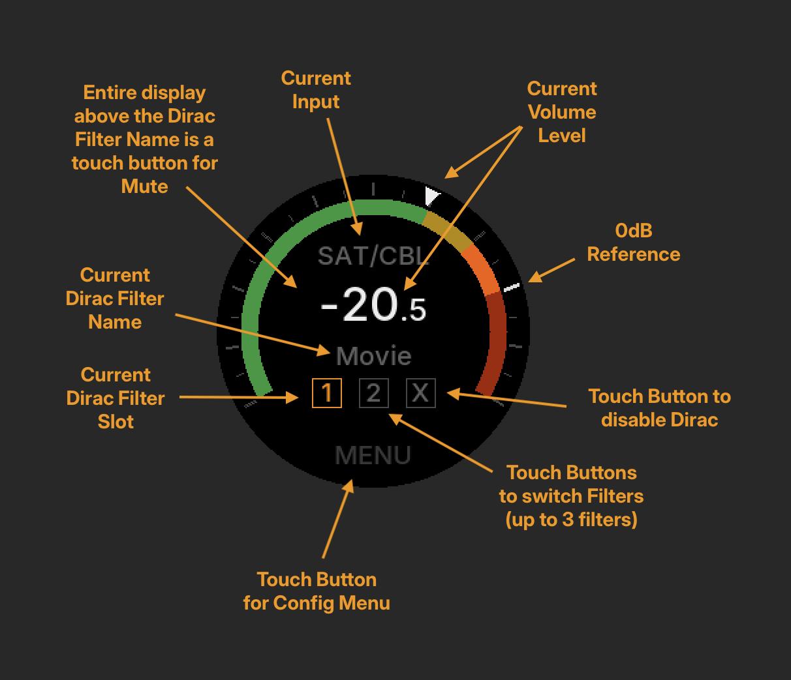
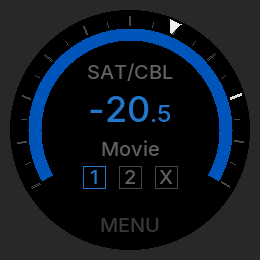

# deloop

deloop is Firmware for the [M5 Dial](https://shop.m5stack.com/products/m5stack-dial-v1-1) that turns it into a dedicated remote and volume knob for a Denon/Marantz AVR, intended for desktop use. You rotate the encoder to change volume, tap the scren to mute, and there is touch menu for inputs / Dirac Live presets / and device settings.



## How was AI used in developing deloop?

Not vibecoded, but step-by-step agentically assisted/written by Claude and an experienced engineer who has been doing projects on ESP32 for a decade.

## Features

- Volume up/down via the rotary encoder, with acceleration on a fast spin
- State display for AVR: Volume, Current Input, Current Dirac Filter
- Live circular color gauge display of volume (dB) with a moving indicator
- Main screen tap controls: mute, filter selection, menu, power (long press)
- Touch menu: input selection, Dirac filter selection, brightness, click sound on/off, restart device
- Synced against the AVR so external changes (app, another remote) update deloop.
- Runs on [CircuitPython](https://circuitpython.org/board/m5stack_dial/)
- Note that deloop is not currently designed to support displaying and/or updating Audyssey filters.

## User Interface

The main screen's color bar has a white triangular pointer that rotates around the color bar live as you adjust the volume with the rotary encoder, indicating current position within the volume range on a Denon AVR:

- green:  -80dB to -20dB
- yellow: -20dB to -10dB
- orange: -10dB to 0dB
- red: 0dB to +18dB
- Major ticks indicate 10dB increemnts
- Minor ticks indicate 5dB increments



### Mute

Tapping the screen area anywhere above the Dirac filter name will mute the Denon. While muted, the volume number and all color elemnts on the display appear blue, and the number will slowly pulsate like a sleep indicator.



### Standby

When the AVR is in standby mode, a dim power button is displayed. A long press will power the AVR on and cycle back to the main screen.


Note: the screen shots are pixel-accurate renders of `dial_ui.py`'s actual drawing code (see `make renders` below), not mockups.

## Hardware

- Only tested on the M5Dial ([docs](https://docs.m5stack.com/en/core/M5Dial)). The M5Dial is a panel mount device that mounts thru a 45mm hole. There are other ESP32 rotary encoders out there, but I would not expect them work out of the box with this project.
- A modern Denon/Marantz AVR reachable over Wi-Fi (developed against an AVR-X4800H; see `src/denon.py` for the HTTP control API details)

## Setup

1. Flash the M5 Dial with CircuitPython.
2. Set up the host-side dev environment (one time):
   ```
   python -m venv .venv
   make bootstrap
   ```
3. Copy the settings template and fill in your Wi-Fi and your AVR IP Address:
   ```
   cp src/settings.toml.template src/settings.toml
   ```
   `src/settings.toml` is gitignored — it holds your Wi-Fi password and AVR IP and should never be committed.
4. With the Dial mounted as `/Volumes/CIRCUITPY`, deploy everything:
   ```
   make full-deploy
   ```

After the first deploy, `make deploy` is the fast path for iterating on firmware changes if you decide make your own tweaks (skips reinstalling CircuitPython libraries).

## Makefile targets

| Target         | Purpose                                                              |
|----------------|-----------------------------------------------------------------------|
| `bootstrap`    | Install host-side dev tools into `.venv` (run once per machine)      |
| `install-libs` | Install required CircuitPython libraries onto the mounted device    |
| `full-deploy`  | `install-libs` + copy all firmware files (fresh flash / onboarding)  |
| `deploy`       | Copy firmware files only (fast iteration)                            |
| `fonts`        | Regenerate the Inter PCF bitmap fonts from the TTF source            |
| `splash`       | Regenerate the splash screen BMP from `ui/hobbysprawl.png`           |
| `renders`      | Render dial_ui.py's screens to PNGs without the device, into `local/renders/` (`tools/dial_sim.py`) |
| `ls`           | List files on the mounted device                                    |
| `shell`        | Open an interactive CircuitPython REPL over USB serial               |
| `probe`        | Host-side HTTP probe against the AVR control API (`PROBE_ARGS=...`)  |
| `dump-avr`     | Dump full AVR state via `python-denonavr` (endpoint/version discovery) |

`fonts` and `renders` need the Inter font family locally -- it's not shipped with the project. Grab v4.1 from [github.com/rsms/inter/releases](https://github.com/rsms/inter/releases) and extract it to `local/Inter-4.1` (gitignored). Neither target is required for normal flashing/use, only for regenerating fonts or screenshots.

## Configuration

Settings live in `src/settings.toml` (see `src/settings.toml.template` for all available keys): Wi-Fi credentials, AVR host/port, and volume step sizes and acceleration thresholds. `src/config.py` reads these at boot and applies safe defaults for anything left unset.

## Code layout

- `src/code.py` — CircuitPython entry point: input handling (encoder, touch), menu state machine, and the main loop
- `src/denon.py` — HTTP client for the Denon/Marantz control API (volume, power, mute, inputs, Dirac Live)
- `src/dial_ui.py` — display rendering: the circular gauge, volume readout, and menu overlay
- `src/state.py` — in-memory model of AVR state, reconciled against periodic polls
- `src/sound.py` — piezo buzzer click feedback for taps and menu actions
- `src/config.py` — settings loader/defaults
- `tools/` — host-side scripts used during development (AVR protocol probing, font/splash generation, off-device screen rendering); not deployed to the device
- `local/` — gitignored, not shipped: the Inter font family download and `make renders` output land here

## What is hobbysprawl?

It's the umbrella name for my creations.