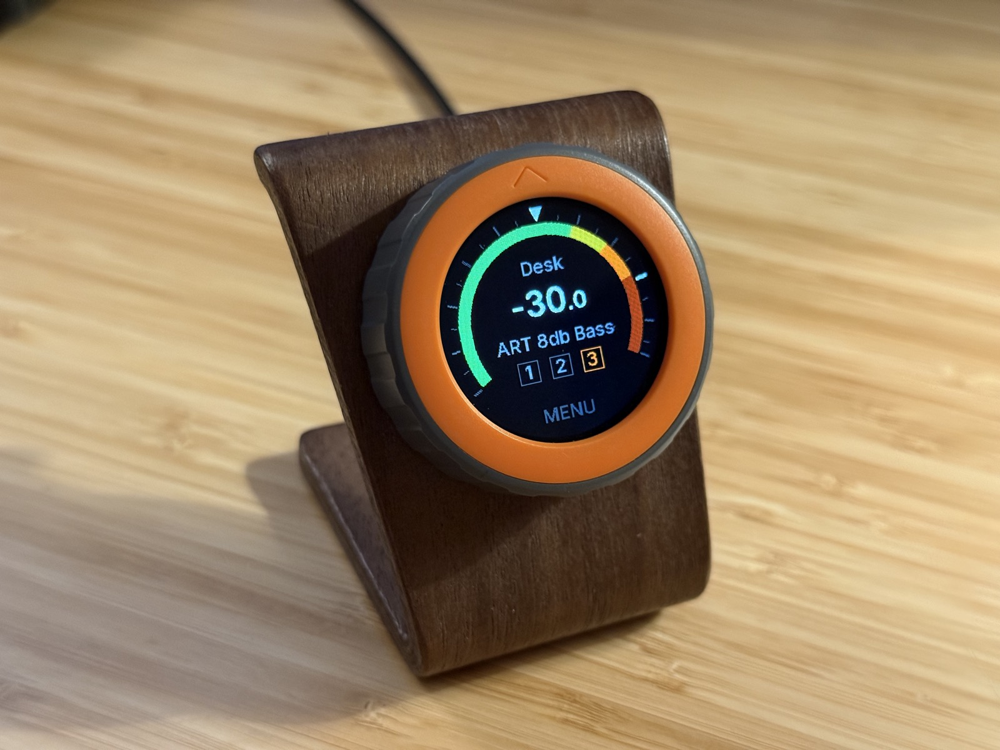
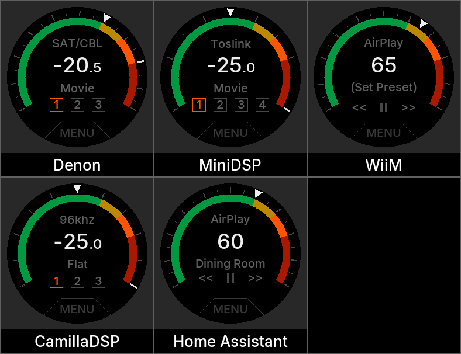
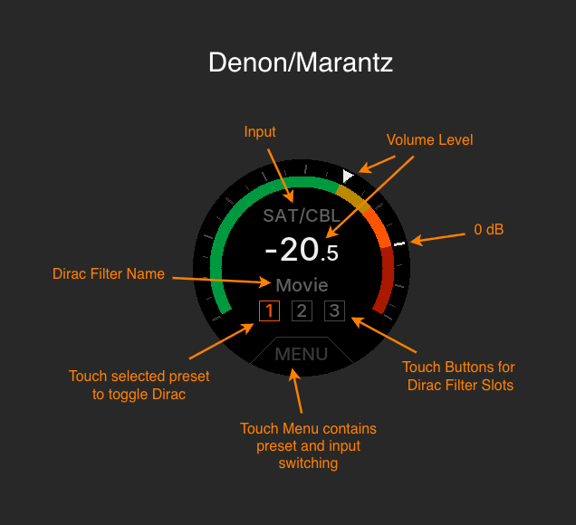
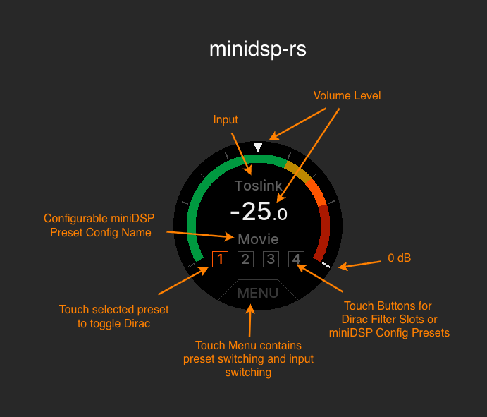
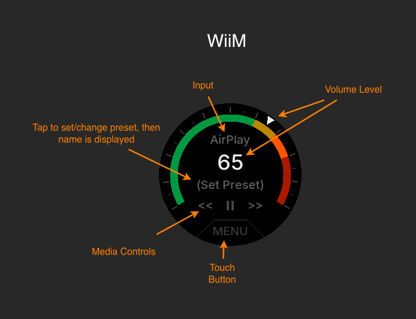
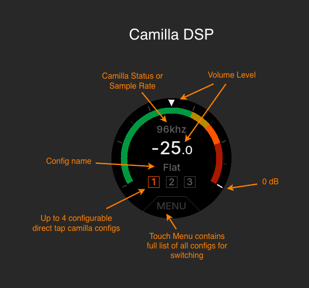
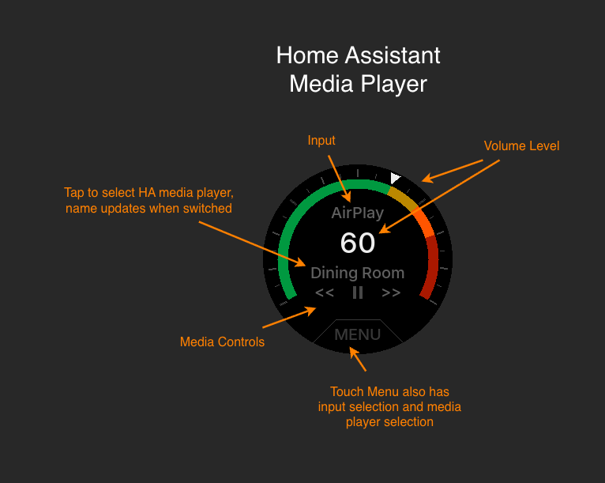
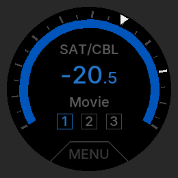

# deloop

deloop is an open-source applciation for the [M5 Dial](https://shop.m5stack.com/products/m5stack-dial-v1-1) that turns it into a focused remote and volume knob and config switcher with support for the following devices/platforms:

*  Denon/Marantz AVRs (2016+, Presets only on Dirac Live licensed AVRs)
*  minidsp-rs
*  CamillaDSP
*  WiiM/LinkPlay streamers
*  Home Assistant media player entities

As a package, it is wired, compact, and generally intended for desktop use. You rotate the encoder to adjust volume, and tap the upper half of the screen to mute. Input switching thru the menu is suppored on all devices. For devices that support DSP presets, up to 4 touch buttons can display on the sceen, with a menu to access more if needed. Home Assistant media players and WiiM streamers that support media controls will also get basic play/pause/skip buttons.

deloop is not a replacement for a full remote, an app or config interface for these devices, and is quite limited in its control scope to keep it focused as a simple volume, preset, and input contoller and display for daily use.

The M5Dial is a panel mount device that mounts thru a 45mm hole. It can be mounted all sorts of ways, but does not stand well on it's own, so you'll need to sort out some kind of plan. Below it's shown mounted in a $6 wood phone stand off Amazon that I drilled a 45mm hole thru. 



## How was AI used in developing deloop?

This project is step-by-step agentically assisted/written/maintained by Claude and an experienced engineer who has been building hobby projects on ESP32 since shortly after release. This repo contains a [CLAUDE.md](.claude/CLAUDE.md) file that carries a huge amount of project context. Claude is directed continuously to update this file as the project evolves, and it is intended to be human readable if you are curious what kind of reasoning went into this project. My deveopment process treats all AI output as unverified until tested on real hardware and proven, so every back end was developed and tested against the real thing.

If you decide you want to modify/extend the deloop code, this file will make Claude very good at working with this project, including things like how to use the tools for things like rendering screen mockups, probing devices, and performing tests on the device.

## Features

- Volume up/down via the rotary encoder, with acceleration on a fast spin
- State display: Volume, Current Input, Current preset/filter
- Live circular color gauge display of volume (dB) with a moving indicator
- Main screen tap controls: mute, preset selection, dirac toggle, menu, power (long press, Denon & HA media players only)
- Tap the already-active preset to disable it in place (e.g. Dirac Live off) without losing which one is loaded -- it stays highlighted, just in gray instead of orange
- Screen grays out while a preset change is slowly appling (confirmed several seconds on MiniDSP config-slot switches), then returns to color once it's done.
- Touch menu (not all items on all devices): input selection, preset selection, device selection, brightness, click sound on/off, restart device
- Synced against the device thru polling so external changes (app, another remote) update deloop.
- Runs on [CircuitPython](https://circuitpython.org/board/m5stack_dial/)
- Pluggable device backend (`src/driver.py`) -- see [Device backends](#device-backends)
- Note that deloop is not currently designed to support displaying and/or switching Audyssey filters on Deonon/Marantz.
- Manual over-the-air updates directly from this GitHub repo (not a phone-home or update server) thru the Menu.

## User Interface

The main screen's color bar has a white triangular pointer that rotates live around the color bar as you adjust the volume with the rotary encoder, indicating current position within the active backend's volume range. The color bands are proportional to that range -- bottom 60% green, next 10% amber, next 10% orange, top 20% red -- which on a Denon AVR's -80dB..+18dB range works out to:

- green:  -80dB to -20dB
- yellow: -20dB to -10dB
- orange: -10dB to 0dB
- red: 0dB to +18dB
- Major ticks indicate 10dB increemnts
- Minor ticks indicate 5dB increments

deloop has volume range defaults for each back end that should feel appropriate, but the device's volume range is also configurable via settings file. 

Because each back end device type has slightly different options, I've taken care to implement the user interface to uniquely take advantage of each back end. As such, the UI varies some depending on device capability. There are diagrams below the renders to explain the main UI per backend. Note that the renders in this readme are generated from the actual drawing code, and each was rendered with realistic configs for their backend, and are pixel perfect representations of the display. 



### Per Device UI Guides:







### Mute

Tapping the screen area anywhere above the preset name will mute the device. While muted, the volume number and all color elemnts on the display appear blue, and the number will slowly pulsate like a sleep indicator. Set `MUTE_PULSE = "false"` in `settings.toml` if you don't want the pulsing.



### Standby

For devices that support power, when the device is in standby mode, a dim power button is displayed. A long press will power the device on and cycle back to the main screen.


## Hardware

- Only tested on the [M5Dial](https://docs.m5stack.com/en/core/M5Dial). There are lots of other ESP32 rotary encoders out there, but I would not expect them work out of the box with this project. If you want to investigate porting it or trying it elsewhere, download this repo and have Claude perform that investigation. It's very good at doing this since it's CLAUDE.md file is well trained on the device hardware and quite good at sorting out what libraries work with what hardware.

## Device backends

Note that from here down, the Readme is entirely produced by Claude.

deloop talks to the amp through a swappable driver module (`src/driver.py`), selected by the `DEVICE_DRIVER` key in `settings.toml`. `app.py` and `dial_ui.py` never talk to a specific backend directly -- they read a `CAPS` dict the active driver exports to decide which menu items and gestures to offer, so a backend that can't do something (e.g. no power state) simply doesn't advertise that capability rather than needing special-casing throughout the UI code. See the contract documented at the top of `src/driver.py` if you want to add another backend.

|                    | `denon` (default)                          | `minidsp`                                          | `camilladsp`                                        | `ha`                                                | `wiim`                                              |
|--------------------|---------------------------------------------|-----------------------------------------------------|-------------------------------------------------------|----------------------------------------------------|----------------------------------------------------|
| Talks to           | The AVR directly over Wi-Fi                  | A [minidsp-rs](https://github.com/mrene/minidsp-rs) daemon on some host machine with the MiniDSP attached over USB | A [CamillaDSP](https://github.com/HEnquist/camilladsp) process on some host machine, over its WebSocket control API (no HTTP option exists) | A [Home Assistant](https://www.home-assistant.io/) instance's REST API, controlling any `media_player` entity | The streamer directly over Wi-Fi, same as `denon` |
| Extra dependency   | None                                          | That host must be running and reachable on the LAN -- run with no `--config` at all and it already binds to `0.0.0.0:5380` (all interfaces); a config file only takes effect if passed explicitly via `--config`, and its example ships with the restrictive `127.0.0.1:5380` active by default | That host must be running CamillaDSP, started with a websocket port (`-p`) and bound to a LAN-reachable address (`-a 0.0.0.0` or similar -- it defaults to `127.0.0.1`, local-only) | A Home Assistant instance reachable on the LAN and a long-lived access token (Profile -> Security -> Long-Lived Access Tokens) | None -- but its API is HTTPS-only with a self-signed certificate; deloop already trusts it (the same fixed cert ships on every LinkPlay unit), no setup needed |
| Power/standby      | Yes (long-press gesture)                     | No -- the DSP is "on" whenever the host + USB link are up; the long-press gesture is disabled | No -- same reasoning as `minidsp`, the DSP is "on" whenever its host process is running | Auto-detected from the entity's `supported_features` -- on if it supports both `turn_on` and `turn_off`, off otherwise | No -- no power/standby concept found in the streamer's API; the long-press gesture is disabled, same as `minidsp` |
| Input selection     | Named HDMI-style sources, renamed by the AVR | The DSP's source enum (Toslink/USB/Analog/...), derived from the unit's hw_id -- see `src/minidsp.py` | No selectable input -- CamillaDSP's capture device lives inside its loaded config file, not a separate switchable axis; switching capture devices is just a different preset (below). The otherwise-unused input display instead shows live DSP status: the processing rate (e.g. `96khz`) while actively processing audio, or the raw processing state (`Paused`/`Inactive`/`Starting`/`Stalled`) otherwise | The entity's own `source_list`, auto-detected the same way as power | A configurable list of switchable sources (default: WiFi, Bluetooth, Line In, Optical) -- set `WIIM_INPUTS` to match your unit, since the API has no way to report which physical inputs it actually has |
| Presets            | Dirac Live filter picker. Selecting a filter always engages it -- there's no separate on/off bit, so switching filters and enabling are the same action | Always the DSP's config-slot switching (0..N-1) -- slot count isn't discoverable via the API, set `MINIDSP_PRESET_COUNT` to match your unit. Names default to "Preset 1", "Preset 2", etc. since the API can't read slot names back either -- set `MINIDSP_PRESET_NAMES` to override. If the unit also reports a `dirac` field (e.g. a Flex with a Dirac license), tapping the *active* slot additionally toggles Dirac on/off in place; switching to a *different* slot deliberately leaves that on/off state untouched, since a slot may want Dirac off on purpose (e.g. a headphone config) -- see `CAPS["preset_select_enables"]` in `src/driver.py` | A fixed list of CamillaDSP config files, set via `CAMILLADSP_PRESETS` as `"Name:/path,Name2:/path2"` pairs -- there's no slot count to configure, just the list itself, always reachable through the scrollable Preset menu regardless of length. Unlike `minidsp`/`wiim`, the currently active preset is a real reported value (`GetConfigFilePath`), not a guess or a permanent placeholder. Main-screen quick-select buttons are a *separate*, smaller list -- up to 4 names from `CAMILLADSP_PRESETS`, set via `CAMILLADSP_QUICK_PRESETS` -- since unlike MiniDSP's physically-fixed slot count, the full list has no real ceiling and could easily outgrow the button row; leave it unset for submenu-only, same as `wiim` | Not supported -- there's no generic `media_player` equivalent of Dirac Live/config slots, so no preset menu is drawn at all | Your WiiM-app Favorites, activated via `MCUKeyShortClick`. The plain HTTP API can't list Favorites back reliably (confirmed live -- `getPresetInfo` stays empty even with real ones configured; real names need WiiM's separate UPnP/SOAP interface, not implemented here) -- same fallback as `minidsp`: set `WIIM_PRESET_COUNT` to how many you've configured and optionally `WIIM_PRESET_NAMES` to label them. Reachable through the scrollable Preset menu, never the main-screen quick-select buttons (`denon`/`minidsp` use those instead) -- a WiiM unit can have up to 12 favorites, more than the 5 buttons that row was designed for -- or by tapping the status row itself, which jumps straight into the Preset menu. Since a preset here is a one-shot action rather than a persistent mode, that row shows "(Preset)" until you pick one, rather than sitting blank |
| Preset switch speed | Near-instant                                | Confirmed ~4s+ on real hardware -- minidsp-rs's POST blocks until the DSP finishes reconfiguring. The screen shows a static gray frame for the duration (see `dial_ui.draw_busy`); raise `MINIDSP_PRESET_TIMEOUT` if your unit is slower than the ~10s default | Confirmed ~1-3ms against a trivial test config (a signal generator + one filter, no FIR/convolution files to load) -- but that's a lower bound, not a general answer: a real room-correction config with large filter files could be much slower to load. `CAMILLADSP_PRESET_TIMEOUT`'s generous ~10s default is unchanged until someone times a real production config | N/A -- no presets | Near-instant |
| Volume range       | -80dB to +18dB (dB relative to reference)    | -127dB to 0dB (dB of attenuation below unity) -- the gauge's color bands and tick marks scale to whichever range is active | -50dB to 0dB by default -- CamillaDSP's `SetVolume` actually accepts -150..+50 server-side, but -50..0 matches [CamillaGUI](https://github.com/HEnquist/camillagui-backend)'s own default volume-slider range (`volume_range: 50` / `volume_max: 0`, confirmed from its source), a more practical default than the full protocol range. Both `minidsp` and `camilladsp` use the identical dB convention (20·log10 of amplitude, confirmed from CamillaDSP's own source), so -50dB is the same amount of digital attenuation on both -- but not necessarily the same perceived loudness, since that also depends on each system's downstream DAC/amp gain. Raise `VOLUME_MAX` if a config genuinely needs headroom above unity | 0 to 100 percent -- HA always normalizes `volume_level` to a 0.0-1.0 fraction regardless of the underlying device, so there's no real dB value to show | 0 to 100 percent -- the streamer's own native volume range, no conversion needed |
| Playback control    | N/A                                            | N/A                                                   | N/A                                                    | Off by default -- set `HA_MEDIA_CONTROLS = true` to opt in. When on, the status line below the volume shows "Playing"/"Paused" (tap to toggle) whenever the entity reports one of those two states, with `<`/`>` on either side to skip back/forward; blank/no tap targets otherwise. Rougher than the other fields -- whether it does anything real depends on the currently selected source (e.g. a no-op on a plain analog input) | Always on -- the status line shows "Playing"/"Paused" (tap to toggle) plus `<`/`>` skip controls, same behavior as `ha`'s opted-in playback control but without the "unreliable on some sources" caveat (a streaming source either is or isn't currently playing) |
| Media Player menu   | N/A                                            | N/A                                                   | N/A                                                    | Discovers every `media_player` entity in your HA instance at boot and adds a menu to switch which one deloop controls -- `HA_ENTITY_ID` is only the startup default. Switching re-checks the new entity's `supported_features` on the spot, so e.g. Input selection or Power can appear/disappear if the newly selected entity's capabilities differ from the previous one's. Since it's no longer always obvious which device you're looking at, the currently targeted device's name is always shown in dim gray below the status line, and if it's powered off, a MENU hint appears on that screen too (unlike the other backends' deliberately bare power-off screen) so you're never stuck needing to power on the wrong device just to switch away from it | N/A -- `wiim` only ever controls the one streamer at `WIIM_HOST` |

The `minidsp` backend derives its input list and Dirac/preset behavior from what the unit itself reports (hw_id, dsp_version, and whether a "dirac" field comes back at all) rather than hardcoding one model, so it's meant to work across whatever minidsp-rs itself supports, not just the two units it's been verified against so far (a 2x4HD and a Dirac-licensed Flex).

If more than one MiniDSP is ever attached to the same host at once, set `MINIDSP_SERIAL` instead of relying on `MINIDSP_DEVICE_INDEX` -- minidsp-rs's `/devices` array order follows USB enumeration order, which is not guaranteed stable across reconnects.

The `camilladsp` backend controls a [CamillaDSP](https://github.com/HEnquist/camilladsp) process's volume, mute, and config-file switching over its WebSocket API -- the only control interface it exposes, unlike minidsp-rs which also offers plain HTTP. CircuitPython has no usable WebSocket library for this board, so `src/camilladsp.py` implements a minimal hand-rolled client (opening handshake, masked frame send/unmasked frame receive, one fresh connection per call). Confirmed working end-to-end on real M5 Dial hardware against a real CamillaDSP process (volume, mute, and touch controls all functioning) -- see `make probe-camilladsp` for how to check the command/reply shapes independently first (using the real `websocket-client` package), and `.claude/CLAUDE.md`'s "Backend #5" section for what's been verified vs. what's still open (preset-switch timing was only measured against a trivial test config so far).

The `ha` backend works with any `media_player` entity, not just Denon/Marantz ones -- it's the same REST API regardless of what HA integration actually created the entity. It's plain synchronous polling on the same adaptive schedule as the other two backends (no event subscription, no persistent connection) -- deliberately as simple as `denon`/`minidsp`, just pointed at HA instead of the device directly.

Discovery (for the Media Player menu above) uses a single `POST /api/template` call rendering a compact Jinja expression instead of `GET /api/states`, which would return every entity in your house, not just media players -- a much bigger payload than an ESP32 needs to parse just to build a menu.

The `wiim` backend talks to a [WiiM](https://www.wiimhome.com/) (or any LinkPlay-based) streamer's own `httpapi.asp` API directly, no bridge or daemon required. Its one real wrinkle is that the API is HTTPS-only with a self-signed certificate -- LinkPlay ships the exact same fixed cert on every unit, so deloop just trusts it outright rather than needing you to extract and configure your own. The physical/network input list (`WIIM_INPUTS`) defaults to what was confirmed working on a WiiM Pro (WiFi, Bluetooth, Line In, Optical); other models may expose a different set since there's no API that reports it.

Before flashing, `make probe-minidsp` / `make probe-camilladsp` / `make probe-ha` / `make probe-wiim` (host-side, needs the daemon/process/HA instance/streamer reachable) hit the same commands `src/minidsp.py`/`src/camilladsp.py`/`src/ha.py`/`src/wiim.py` use and print the raw responses, so you can confirm the shapes match your setup before wiring up the device. This matters more than usual for `probe-camilladsp`: it's the only one of the four that validates the API shapes using a known-good client library rather than the same code path the device will actually run (see "Device backends" above).

## Setup

1. Flash the M5 Dial with CircuitPython.
2. Set up the host-side dev environment (one time):
   ```
   python -m venv .venv
   make bootstrap
   ```
3. Copy the settings template and fill in your Wi-Fi and your device settings (AVR IP, or `DEVICE_DRIVER = "minidsp"` plus the `MINIDSP_*` keys, or `DEVICE_DRIVER = "camilladsp"` plus the `CAMILLADSP_*` keys, or `DEVICE_DRIVER = "ha"` plus the `HA_*` keys, or `DEVICE_DRIVER = "wiim"` plus the `WIIM_*` keys):
   ```
   cp src/settings.toml.template src/settings.toml
   ```
   `src/settings.toml` is gitignored — it holds your Wi-Fi password and device address(es) and should never be committed.
4. `make full-deploy` needs `local/mpy-cross`, a CircuitPython-version-matched compiler binary (not the generic `pip install mpy-cross` package) -- see the `MPY_CROSS` comment in the Makefile for where to download it and how to check your device's exact version. `local/` is gitignored; this binary is never committed.
5. With the Dial mounted as `/Volumes/CIRCUITPY`, deploy everything:
   ```
   make full-deploy
   ```

After the first deploy, `make deploy` is the fast path for iterating on code changes if you decide to make your own tweaks (skips reinstalling CircuitPython libraries, but still needs `local/mpy-cross` -- see step 4). If you don't have `local/mpy-cross` set up yet, or you're chasing a traceback where uncompiled source gives a clearer on-device error, `make deploy-src` copies plain `.py` files instead and needs no extra tooling.

## Makefile targets

| Target         | Purpose                                                              |
|----------------|-----------------------------------------------------------------------|
| `bootstrap`    | Install host-side dev tools into `.venv` (run once per machine)      |
| `install-libs` | Install required CircuitPython libraries onto the mounted device    |
| `full-deploy`  | `install-libs` + `deploy` (fresh flash / onboarding)                 |
| `deploy`       | Precompile every module to `.mpy` and copy to the device -- what it should actually run day to day (needs `local/mpy-cross`) |
| `deploy-src`   | Copy plain, uncompiled `.py` files instead (fast iteration / clearer tracebacks; no `local/mpy-cross` needed) |
| `fonts`        | Regenerate the Inter PCF bitmap fonts from the TTF source            |
| `splash`       | Regenerate the splash screen BMP from `ui/hobbysprawl.png`           |
| `renders`      | Render dial_ui.py's screens to PNGs without the device, into `local/renders/` (`tools/dial_sim.py`) |
| `ui-renders`   | Regenerate the polished per-backend screenshots in `ui/` that this README embeds (`tools/render_ui_screenshots.py`) |
| `ls`           | List files on the mounted device                                    |
| `shell`        | Open an interactive CircuitPython REPL over USB serial               |
| `probe`        | Host-side HTTP probe against the AVR control API (`PROBE_ARGS=...`)  |
| `dump-avr`     | Dump full AVR state via `python-denonavr` (endpoint/version discovery) |
| `probe-minidsp`| Host-side HTTP probe against a minidsp-rs daemon (`PROBE_ARGS=...`)  |
| `probe-camilladsp` | Host-side WebSocket probe against a CamillaDSP process (`PROBE_ARGS=...`) |
| `probe-ha`     | Host-side REST probe against a Home Assistant instance (`PROBE_ARGS=...`) |
| `probe-wiim`   | Host-side HTTPS probe against a WiiM/LinkPlay streamer (`PROBE_ARGS=...`) |
| `probe-ota`    | Host-side probe against GitHub Releases for the OTA feature (`PROBE_ARGS=...`) |
| `build-manifest` | Build an OTA `manifest.json` locally from whatever `make deploy` last compiled, for testing before a real release |

`fonts` and `renders` need the Inter font family locally -- it's not shipped with the project. Grab v4.1 from [github.com/rsms/inter/releases](https://github.com/rsms/inter/releases) and extract it to `local/Inter-4.1` (gitignored). Neither target is required for normal flashing/use, only for regenerating fonts or screenshots.

## Configuration

Settings live in `src/settings.toml` (see `src/settings.toml.template` for all available keys): Wi-Fi credentials, which device backend to use (`DEVICE_DRIVER`), that backend's host/port, and volume step sizes and acceleration thresholds. `src/config.py` reads these at boot and applies safe, per-backend defaults for anything left unset.

## Updating deloop

deloop can update its own app files over Wi-Fi from this repo's GitHub Releases, without plugging into a computer. This is **not** a CircuitPython firmware updater — it never touches the CircuitPython build itself, only the app files this repo's own `make deploy` ships.

- **Manual only.** deloop never checks for updates in the background. Open the on-screen **Update** menu, which shows the currently installed version, and tap **Check Now**. If a newer release is available, tap **Install Update** to download, verify, and apply it.
- **How it actually runs.** Both actions do a `supervisor.reload()` (CircuitPython's own file-change-reload mechanism, not a hardware reset) into a lightweight mode that does the real network/filesystem work, then reload back to the normal screen with the result. The whole check-or-install happens live, in one pass — no reboot involved at all.
- **The one dependency: if the Dial happens to be plugged into a computer with the drive actively mounted, eject it first.** Writing its own files requires the device to briefly take write access back from the host, which only works when the host isn't holding the drive open. If it's mounted, the Update menu will say so (`Eject drive first`) instead of failing silently.
- **How releases are built.** Every push to `main` triggers a GitHub Actions workflow (`.github/workflows/release.yml`) that computes the next version (highest existing `vN` tag + 1 — versions are never hand-chosen), compiles every module to `.mpy` with a version-matched `mpy-cross`, builds a manifest, and publishes it all as a new GitHub Release. Nothing to do locally to publish a release beyond merging to `main`; it can also be re-run with no new commit from the Actions tab ("Run workflow").
- **Settings** (`src/settings.toml.template`, "Self-update" section): `OTA_ENABLED` (kill switch — set `false` to hide the Update menu entirely), `OTA_REPO` (which GitHub repo to check, defaults to this one), and timeouts. None of these need changing for normal use.
- **Safety.** Every file is downloaded and its checksum verified *before* any live file is touched — a failed or interrupted download never leaves a half-installed state. Worst case if something does go wrong: plug in USB and `make deploy` again, exactly like any other code update.

## Code layout

- `src/code.py` — CircuitPython entry point: must stay tiny, since it's the one file that can't be `.mpy`-compiled. Just `import app; app.main()`
- `src/app.py` — the real entry-point logic: input handling (encoder, touch), menu state machine, and the main loop
- `src/driver.py` — selects the active device backend and documents the driver contract other backends implement
- `src/denon.py` — HTTP client for the Denon/Marantz control API (volume, power, mute, inputs, Dirac Live presets)
- `src/minidsp.py` — HTTP client for a [minidsp-rs](https://github.com/mrene/minidsp-rs) daemon (volume, mute, input source, config-slot presets)
- `src/camilladsp.py` — WebSocket client for a [CamillaDSP](https://github.com/HEnquist/camilladsp) process (volume, mute, config-file presets); the only WebSocket-based backend, with a hand-rolled client since CircuitPython has no usable WS library for this board -- confirmed working on real hardware, see its module docstring
- `src/ha.py` — REST client for a [Home Assistant](https://www.home-assistant.io/) `media_player` entity (volume, mute, power, source; no presets), plus playback control (play/pause/skip) and discovering/switching between every `media_player` entity HA knows about
- `src/ha_ui.py` — the `ha` backend's paired UI extension (row layout, skip icons, play/pause icon); only imported when `DEVICE_DRIVER = "ha"`
- `src/wiim.py` — HTTP(S) client for a [WiiM](https://www.wiimhome.com/)/LinkPlay streamer (volume, mute, source, play/pause/skip, WiiM-app favorites); the first backend needing TLS, with a pinned self-signed cert
- `src/wiim_ui.py` — the `wiim` backend's minimal paired UI extension (play/pause + skip tap targets only, no device-switching UI); only imported when `DEVICE_DRIVER = "wiim"`
- `src/dial_ui.py` — display rendering: the circular gauge, volume readout, and menu overlay
- `src/state.py` — in-memory model of device state, reconciled against periodic polls
- `src/sound.py` — piezo buzzer click feedback for taps and menu actions
- `src/config.py` — settings loader/defaults
- `src/ota.py` — self-update: checks GitHub Releases, downloads and verifies a new release, installs it. Orthogonal to `DEVICE_DRIVER` — see "Updating deloop" above
- `src/version.py` — deloop's own app version (a bare integer); overwritten by the release workflow, not meaningful in git history
- `tools/` — host-side scripts used during development (AVR/minidsp-rs/HA/GitHub Releases protocol probing, font/splash generation, off-device screen rendering, OTA manifest building); not deployed to the device
- `.github/workflows/release.yml` — builds and publishes a new OTA release on every push to `main` (version auto-incremented, never hand-chosen)
- `local/` — gitignored, not shipped: the `mpy-cross` compiler binary, its `.mpy` build staging dir, the Inter font family download, and `make renders` output all land here

## What is hobbysprawl?

It's the umbrella name for my creations.